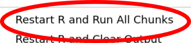
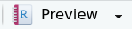

# Tonight

- Data Life Cycle
- Intro To Data Viz - GGPLOT
- Learning Isn't Easy
- Lab

You can read this lecture documentation one of TWO ways:

1. As-is
2. Run all code chunks () and then hit the "Preview" button () in the menu to render the discussion into a HTML document. (This is the pretty option.) To run all code chunks:

```{r echo=FALSE, fig.align='center', out.width = '60%'}
url <- "./includes/run-chunks.png"
knitr::include_graphics(url)
```

And now we just need something silly. You know XKCD is the only way you get through this lecture.

```{r echo=FALSE, fig.align='center', out.width = '40%'}
url <- "https://imgs.xkcd.com/comics/data.png"
knitr::include_graphics(url)
```


# Data Life Cycle

```{r echo=FALSE, fig.align='center', out.width = '80%'}
url <- "https://d33wubrfki0l68.cloudfront.net/571b056757d68e6df81a3e3853f54d3c76ad6efc/32d37/diagrams/data-science.png"
knitr::include_graphics(url)
```

One of the high-level goals of this class is to help you become familiar with the data life cycle. During today's lecture:

- Import: We will import penguins data from CSV.
- Munge: We don't need to clean tonight's data up.
- Visualize/Model: This is our focus tonight. Data Viz!
- Communicate: This is the lab notebooks we are creating.

A traditional statistics course will do SOME data-viz and a bunch of modeling.

- **Good News:** Modeling is important!
- **Bad News:** Data is never clean or shaped the way you need it. And a good plot is worth a thousand t-tests.
- Do you see how I'm using plain text to provide structure/emphasis?

**_Tonight, we will introduce data viz using ggplot._**


# Last Week Tonight

```{r echo=FALSE, fig.align='center', out.width = '75%'}
url <- "https://imgs.xkcd.com/comics/drinking_fountains.png"
knitr::include_graphics(url)
```

## Code Chunks

- Rmd files, also called RMarkdown files, contain plain text and computer code.
- The code usually lives in a thing called a code chunk, fenced like this:

```{r}
## YOUR CODE HERE!

```

In most Rmd files, the FIRST code chunk in a Rmd document is referred to as the setup chunk. This will always be true in your lab notebooks, it is not always true in the lecture notebooks. That said, there will always be a code chunk labeled `setup`. Use this chunk to:

- load libraries
- import data
- set any variables you need for your project
- whatever else you want to do at the very beginning


# Setup (FINALLY)

This is the setup section for this lecture.

```{r setup, message=FALSE, warning=FALSE, paged.print=TRUE}
## Discuss this thoroughly.
library(tidyverse)
penguins <- read_csv("data/penguins.csv")
```

- You MUST run this code chunk once per session.


# Intro to Data Viz

Reasons to plot data:

- Exploratory Data Analysis (EDA)
- Explain something about the data

Regardless of WHY we plot our data, we will use the ggplot series of commands. And these commands are structured to help us remember how to use them:

```{r echo=FALSE, fig.align='center'}
file <- "includes/ggplot flow.drawio.png"
knitr::include_graphics(file)
```

- Your code MUST HAVE the stuff in the orange boxes.
- The stuff in seafoam green? That's optional.
- For more examples and help, see [R Charts](https://r-charts.com/)

## Penguins!!!

```{r echo=FALSE, fig.align='center', out.width = '75%'}
url <- "https://allisonhorst.github.io/palmerpenguins/reference/figures/lter_penguins.png"
knitr::include_graphics(url)
```

First, let's look at our data:

```{r paged.print=TRUE}
penguins
```

- Each row is an **observation**
- Each column is a **variable** or **feature**
    - The term feature is from machine learning, but I tend to use them interchangeably.
- Please note the inclusion of missing values.

Looking at the data directly can be overwhelming, especially for wide data sets. The glimpse function offers another way to get an overview of the data.

```{r paged.print=TRUE}
glimpse(penguins)
```

This makes it very easy to see:

- number of observations (rows) in the table
- number of columns (variable) and column type (character or dbl)
- example entries for each column

When I provide you with data to work with, there will always be a [README.md](./data/README.md) file in the `data` folder.

We will now discuss plotting the data. For tonight's purposes, there are two broad types of plots categorical and numeric. As we plot the data, look for questions to ask of the data. Look for the impact of missing values. Look for things that don't "feel" right. Remember, data science is about more than a math equation or histogram.

## Plots of Categorical Data

These plots are concerned with the count of, percentage, or proportionality of the data.

### Bar Plot

```{r fig.align='center', out.width = '75%'}
ggplot(data = penguins, mapping = aes(x = species)) +
  geom_bar(fill = "darkblue") +
  labs(title = "Count of Species by Type")
```

Note:

- Adelie penguins are the most numerous type of penguin.

If we wanted to compare the types of penguins found on each island, we could use a stacked barplot.

```{r fig.align='center', out.width = '75%'}
## We changed how to define x and fill!
ggplot(data = penguins, mapping = aes(x = island, fill = species)) +
  geom_bar() +
  labs(title = "Count of Species Type by Island")
```

This looks nice, but it is hard to tell which island has the most Adelie penguins. A better way to do this would be:

```{r fig.align='center', out.width = '75%'}
## We changed how to define x and fill!
ggplot(data = penguins, mapping = aes(x = species, fill = species)) +
  geom_bar() +
  labs(title = "Count of Species Type by Island") +
  facet_wrap(~island)
```

Note:

- Now we can see which island had the most Adelie penguins.
- And we can see why Adelie are the most numerous in our data. They were found on all three islands!

We can better control the color of our groups:

```{r fig.align='center', out.width = '75%'}
## We changed how to define x and fill!
ggplot(data = penguins, mapping = aes(x = island, fill = species)) +
  geom_bar() +
  scale_fill_brewer() +
  labs(title = "Count of Species Type by Island")
```

or . . .

```{r fig.align='center', out.width = '75%'}
## We changed how to define x and fill!
ggplot(data = penguins, mapping = aes(x = island, fill = species)) +
  geom_bar() +
  ## Here we are using our colors from above.
  scale_fill_manual(values = c("#ff7a03", "#bf5cca", "#0f7175"))
labs(title = "Count of Species Type by Island")
```

For more information on colors:
- [r-charts.com/color](https://r-charts.com/colors/)
- [Color Brewer](https://colorbrewer2.org/#type=sequential&scheme=Oranges&n=5)

We can also overlay our histograms:

```{r fig.align='center', out.width = '75%'}
ggplot(penguins, aes(x = body_mass_g, fill = species)) +
  geom_histogram(alpha = .6, position = "identity") +
  scale_fill_manual(values = c("#ff7a03", "#bf5cca", "#0f7175"))
labs(title = "Penguin Mass Distribution by Species", x = "Mass (g)", y = "N")
```


## Pie Charts

1. The first rule of pie charts is that you should almost never use pie charts.
2. The second rule of pie charts is that they are a little weird. Some of this code uses functions such as `group_by` and `summarise` which we haven't used. 

With that said, I want to discuss this pie business briefly.

```{r fig.align='center', out.width = '75%'}
## Don't violate the first rule of pie charts.
penguins_by_species <-
  penguins %>%
  group_by(species) %>%
  summarise(n = n()) %>%
  mutate(p = 100 * n / sum(n))
ggplot(data = penguins_by_species, mapping = aes(x = "", y = n, fill = species)) +
  geom_col() +
  coord_polar("y") +
  labs(title = "Count of Species by Type")
```

But they can be a little hard to read.

```{r fig.align='center', out.width = '75%'}
## Don't violate the first rule of pie charts.
penguins_by_species <-
  penguins %>%
  group_by(island, species) %>%
  summarise(n = n()) %>%
  mutate(p = 100 * n / sum(n))
ggplot(data = penguins_by_species, mapping = aes(x = "", y = n, fill = species)) +
  geom_col() +
  coord_polar("y") +
  labs(title = "Count of Species by Type") +
  facet_wrap(~island)
```

Can you easily tell me which island had the highest proportion of Adelie penguins?

## Plots of Numeric Data

We use tools such as histograms, density plots, and violin plots to plot a single continuous numeric variable. We use scatter plots to show the relationship between two variables.

### Histogram

```{r fig.align='center', out.width = '75%'}
ggplot(penguins, aes(x = body_mass_g)) +
  geom_histogram(fill = "darkblue") +
  labs(title = "Penguin Mass Distribution", x = "Mass (g)", y = "N")
```

Note:

- Body mass is a continuous variable. A penguin can weigh any amount in a hypothetical range.
    - If you have data which is numeric, but is fixed to a small number of integer values (likert scale) DO NOT DO THIS!!!!
    - We will discuss this again later in the class.
- We can see that body mass is skewed and long-tailed.
- R is asking us to manually set the number of bins in our plot.
    - `geom_histogram` has a parameter called `bins`, which sets the number of  bars in the histogram.
    - This is different from a bar chart, where the number of bars is determined by the number of factors in the columns.
- How do we know what to set the bins to?

There are standards:

- [https://en.wikipedia.org/wiki/Histogram#Number_of_bins_and_width](https://en.wikipedia.org/wiki/Histogram#Number_of_bins_and_width)
- Square-root choice: `r sqrt(length(mpg$cty))`
this case.)
- [Sturges' formula](="https://wikimedia.org/api/rest_v1/media/math/render/svg/c020d823eb7a197d7db70bc66f8189c2ed7782b8"):
    - `r log2(length(mpg$cty))+1`
- With this many standards, you may be forgiven for thinking there is no standard.
- And you would be right. The question is really this - what are you trying to show about the distribution of the data?

But, there are other ways to show the distribution of a continuous variable such as a density plot. (I like density plots.)
  
```{r fig.align='center', out.width = '75%'}
ggplot(penguins, aes(x = body_mass_g)) +
  geom_density(color = "black", fill = "#ff7a03") +
  labs(title = "Penguin Mass Distribution", x = "Mass (g)")
```

- This tells us the same information, but uses a density plot. 
- The area under the graph must be equal to 1.
- And if we want to go overboard, we can do both in one plot.

```{r fig.align='center', out.width = '75%'}
ggplot(penguins, aes(x = body_mass_g)) +
  geom_histogram(aes(y = stat(density)), fill = "#0f7175") +
  geom_density(fill = "#bf5cca", weight = 5, alpha = .5) +
  labs(title = "Penguin Mass Distribution", x = "Mass (g)", y = "N")
```

We can also compare across islands.

```{r fig.align='center', out.width = '75%'}
ggplot(penguins, aes(x = body_mass_g)) +
  geom_density(fill = "#0f7175") +
  labs(title = "Penguin Mass Distribution", x = "Mass (g)") +
  facet_wrap(~island)
```

Note:

- Penguins on different islands appear to have different average body masses.
- Which makes sense. We already knew each island had a different combination of penguins.

### Box Plots & Violin Plots

These are just two more ways to plot the distribution of a continuous variable.

```{r fig.align='center', out.width = '75%'}
ggplot(penguins, aes(x = island, y = body_mass_g)) +
  geom_boxplot(color = "darkred") +
  labs(title = "Penguin Mass Distribution", x = "Island", y = "Weight (g)")
```

```{r fig.align='center', out.width = '75%'}
ggplot(penguins, aes(x = island, y = body_mass_g)) +
  geom_violin(color = "darkred") +
  labs(title = "Penguin Mass Distribution", x = "Island", y = "Weight (g)")
```

### Scatter Plot

A scatter plot shows the relationship between two continuous numeric variables.

```{r fig.align='center', out.width = '75%'}
## This is slightly different from what is shown in the book.
ggplot(data = penguins, mapping = aes(x = bill_length_mm, y = bill_depth_mm, color = species)) +
  geom_point() +
  labs(
    title = "Relationship between bill length and bill depth",
    x = "Bill Length (mm)",
    y = "Bill Depth (mm)"
  )
```

- What do you see?

And we can even add a regression line.

```{r fig.align='center', out.width = '75%'}
ggplot(data = penguins, mapping = aes(x = bill_length_mm, y = bill_depth_mm, color = species)) +
  geom_point() +
  geom_smooth(method = "lm", color = "maroon", size = 1.5) +
  labs(
    title = "Relationship between bill length and bill depth",
    x = "Bill Length (mm)",
    y = "Bill Depth (mm)"
  )
```

Ooooh. I don't think that is what we want to do.

```{r fig.align='center', out.width = '75%'}
ggplot(data = penguins, mapping = aes(x = bill_length_mm, y = bill_depth_mm, color = species)) +
  geom_point() +
  geom_smooth(method = "lm", color = "maroon", size = 1.5) +
  labs(
    title = "Relationship between bill length and bill depth",
    x = "Bill Length (mm)",
    y = "Bill Depth (mm)"
  ) +
  facet_wrap(~species, ncol = 1, )
```

That's better. Also, this is a fun example of [Simpson's Paradox](https://www.britannica.com/topic/Simpsons-paradox).


# Do you believe me yet?

```{r echo=FALSE, fig.align='center'}
file <- "includes/ggplot flow.drawio.png"
knitr::include_graphics(file)
```

Further reading:

- [Data To Viz](https://www.data-to-viz.com/)
- [GGPlot Documentation](https://ggplot2.tidyverse.org/index.html)
- [Tidyverse Learn](https://www.tidyverse.org/learn/)
- [r-charts.com/color](https://r-charts.com/colors/)
- [Color Brewer](https://colorbrewer2.org/#type=sequential&scheme=Oranges&n=5)


# Learning isn't easy

> The bad news is that when ever you learn a new skill your going to suck. It’s going to be frustrating. The good news is that is typical and happens to everyone and it is only temporary. You can’t go from knowing nothing to becoming an expert without going through a period of great frustration and great suckiness.
> --Hadley Wickham

In addition to these lecture notes, labs, readings, videos, etc. there are other
ways to find help.

- [Stack Overflow](https://stackoverflow.com/questions/tagged/r)
- `?mean` If you prepend a `?` to a command, R provide you with built-in 
  function documentation.

Long story short, programming is not easy. And it can be frustrating when you are learning. I'd like to have a class forum, but we need to make this decision together.


# Questions?

```{r echo=FALSE, fig.align='center'}
url <- "./includes/ggplot-logo.png"
knitr::include_graphics(url)
```

